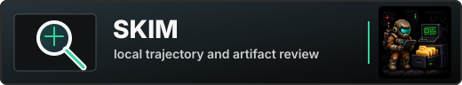

<p align="center">
  
  
  
</p>

<p align="center">
  
</p>

<p align="center"> SKIM makes agent eval review/inspection a smooth and interactive process, and works across the CLI, TUI, and Web UI. </p>

<hr>

💥 **Local artifact explorer:** tree navigation, syntax-highlighted file previews, and structured JSON inspection.

🛡️ **Durable review annotaation:** annotating whole files or structured targets such as JSON nodes can be marked during inspection, then reviewed again from the same local state.

👹 **Human/AI-Agent review:** SKIM collects and preserves the evidence so follow-up actions such as triage, export, evaluation, or automated review can happen with context.

## Surfaces

SKIM is local-first and works across three surfaces:

- **CLI:** annotate files or structured review targets, discover valid targets, and support automatic workflows through `uv run skim annotate ...` from the workspace root.
- **TUI:** browse folders, inspect files, explore JSON structures, and edit annotations from the terminal with `uv run skim <path>`.
- **Web UI:** review the same workspace in a localhost browser interface with `uv run skim-web <path>`.

All annotations stay inside the workspace under `.skim/review.json`. The CLI, TUI, and Web UI read and write the same local review state.

## Example

Inspect a sample trajectory artifact and list the targets that can be annotated:

```bash
uv run skim annotate inspect \
  --root data \
  --file output.json \
  --json
```

Add a note to one suspicious JSON target returned by `inspect`:

```bash
uv run skim annotate add \
  --root data \
  --file output.json \
  --path '$.trajectory.steps[0].output[7]' \
  --tag missing_evidence \
  --tag red_keycard \
  --note "Agent claims the red keycard was found, but this step does not show evidence for that claim." \
  --json
```

List the newest annotations in the workspace:

```bash
uv run skim annotate list \
  --root data \
  --json
```

Update the annotation after another pass:

```bash
uv run skim annotate update \
  --root data \
  --file output.json \
  --path '$.trajectory.steps[0].output[7]' \
  --id ann_001 \
  --tag missing_evidence \
  --tag needs_review \
  --note "Still missing evidence: no trace event shows the red keycard being picked up before the final answer." \
  --json
```

Delete the annotation if it is no longer needed:

```bash
uv run skim annotate delete \
  --root data \
  --file output.json \
  --path '$.trajectory.steps[0].output[7]' \
  --id ann_001 \
  --json
```

Open the same workspace in the TUI:

```bash
uv run skim data
```

Or inspect it in the Web UI:

```bash
uv run skim-web data
```

## Quickstart

Run SKIM from source:

```bash
git clone https://github.com/shizheng-rlfresh/skim.git
cd skim
uv sync
uv run skim .
```

Requires Python 3.12 or newer.

See [docs/usage.md](./docs/usage.md) for TUI, Web UI, and annotation CLI
commands.

## License

MIT
